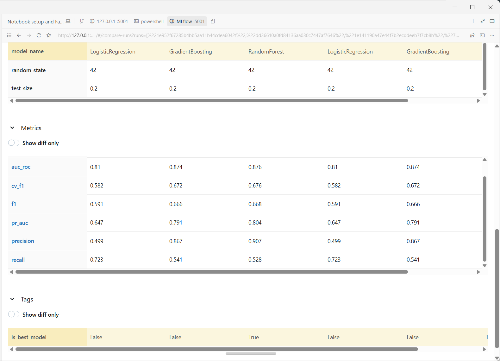
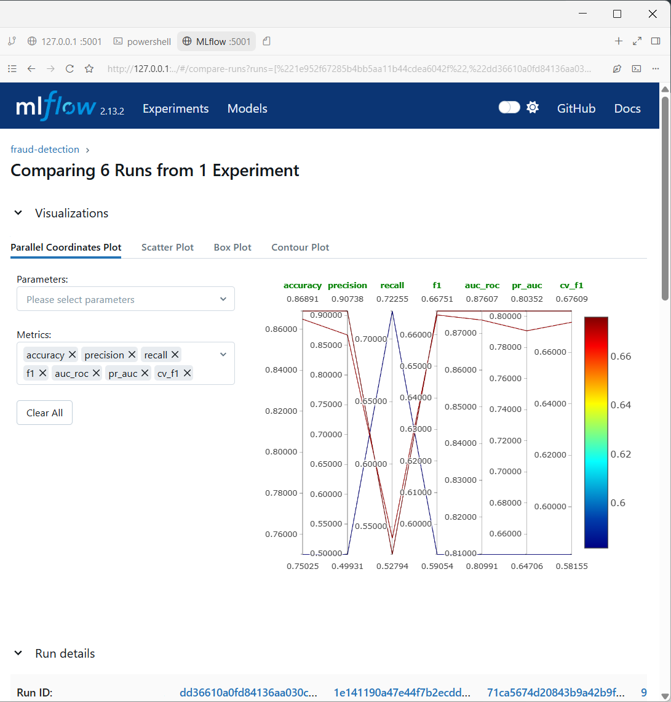

# Fraud Detection API

## 🚀 Live Deployment

**Azure Container Instances (Microsoft Azure)**
- Live API: http://fraud-detection-navi.eastus.azurecontainer.io:8000
- Health check: http://fraud-detection-navi.eastus.azurecontainer.io:8000/health
- Deployed via: Azure Container Registry + Azure Container Instances
- Infrastructure: Docker container on Linux, 1 vCPU, 1.5GB RAM

Healthcare claims fraud detection served as a FastAPI REST API, backed by a scikit-learn Random Forest model and packaged with Docker.

## What This Project Does

This project scores synthetic healthcare insurance claims for fraud risk using a trained Random Forest classifier. A FastAPI service exposes predictions over HTTP, with model artifacts loaded at startup from `artifacts/`. The pipeline was tuned on imbalanced data: the default 0.5 decision threshold yields F1 0.667, while precision–recall analysis selects 0.2725 as the operating point, improving F1 to 0.713 by trading some precision for recall on rare fraud cases. The same backend powers optional Streamlit and Gradio UIs, and the API is containerized for deployment.

## Project Structure

```
App/
├── api/
│   ├── __init__.py
│   ├── main.py
│   ├── schemas.py
│   └── routers/
│       ├── __init__.py
│       ├── health.py
│       └── predict.py
├── artifacts/
│   ├── fraud_pipeline.joblib
│   └── model_metadata.json
├── tests/
│   ├── __init__.py
│   └── test_api.py
├── app_streamlit.py
├── app_gradio.py
├── predict_utils.py
├── Dockerfile
├── docker-compose.yml
├── requirements.txt
├── render.yaml
├── test_predict.json
└── index.html
```

## Model Performance

| Metric | Value |
|--------|-------|
| Algorithm | Random Forest |
| Default threshold F1 | 0.667 |
| Tuned threshold | 0.2725 |
| Tuned F1 | 0.713 |
| AUC-ROC | 0.876 |

## Quick Start (Docker)

```powershell
git clone <repository-url>
cd App
docker compose up --build
```

```powershell
curl.exe http://127.0.0.1:8000/
```

```powershell
curl.exe http://127.0.0.1:8000/health
```

```powershell
curl.exe -X POST http://127.0.0.1:8000/predict -H "Content-Type: application/json" -d "@test_predict.json"
```

The `docker-compose.yml` service mounts `./artifacts:/app/artifacts`, so you can replace `fraud_pipeline.joblib` and `model_metadata.json` on the host without rebuilding the image.

## Quick Start (Local)

```powershell
cd App
pip install -r requirements.txt
uvicorn api.main:app --reload
```

```powershell
curl.exe http://127.0.0.1:8000/
```

```powershell
curl.exe http://127.0.0.1:8000/health
```

```powershell
curl.exe -X POST http://127.0.0.1:8000/predict -H "Content-Type: application/json" -d "@test_predict.json"
```

## API Reference

| Method | Path | Description |
|--------|------|-------------|
| GET | `/` | Health ping |
| GET | `/health` | Model name and tuned threshold |
| POST | `/predict` | Fraud prediction with confidence score |

## Deploy to Render

This repo includes `render.yaml` for a [Render](https://render.com) web service named `fraud-detection-api`.

### Artifact requirement

The API loads these files at startup from `artifacts/`:

| File | In plain Git? | How to ship |
|------|----------------|-------------|
| `model_metadata.json` | Yes | Committed normally |
| `fraud_pipeline.joblib` | **No** (~125 MB) | **Git LFS** (recommended) or download at build time |

`*.joblib` is listed in `.gitignore` except `artifacts/fraud_pipeline.joblib`, which is tracked via Git LFS (see `.gitattributes`).

### Option A — Git LFS (recommended)

1. Install [Git LFS](https://git-lfs.github.com/) locally.
2. From `App/`:

```powershell
git lfs install
git lfs track "artifacts/fraud_pipeline.joblib"
git add .gitattributes artifacts/fraud_pipeline.joblib
git commit -m "Track model pipeline with Git LFS"
git push
```

3. On GitHub: **Settings → Git LFS** — ensure LFS is enabled for the repository.
4. In Render: **New → Blueprint** → connect `fraud-detection-api` → apply `render.yaml`.

The build runs `git lfs pull` so `fraud_pipeline.joblib` is present before the app starts.

### Option B — Download at build time

If you host `fraud_pipeline.joblib` at a stable URL (S3, GitHub Release, etc.):

1. In Render → your service → **Environment**, add:

   `MODEL_JOBLIB_URL` = `https://your-url/fraud_pipeline.joblib`

2. Redeploy. `scripts/fetch_model.sh` downloads the file when it is missing and the variable is set.

`model_metadata.json` must still be in the repo (or copied into `artifacts/` another way).

### Render service settings (from `render.yaml`)

- **Start:** `uvicorn api.main:app --host 0.0.0.0 --port $PORT`
- **Health check:** `GET /health`

After deploy:

```powershell
curl.exe https://YOUR-SERVICE.onrender.com/health
```

### Docker (unchanged)

Local Docker still mounts host artifacts; no LFS required on your machine if the file already exists under `App/artifacts/`:

```yaml
volumes:
  - ./artifacts:/app/artifacts
```

## MLflow Experiment Tracking

Training is tracked with [MLflow](https://mlflow.org) from the project root (`E:\Datasets\Fraud Detection\`), alongside the existing notebook export to `App/artifacts/`.

### What gets logged

| Item | Details |
|------|---------|
| **Experiment** | `fraud-detection` |
| **Runs** | One per model (LogisticRegression, RandomForest, GradientBoosting) |
| **Parameters** | Estimator hyperparameters + pipeline settings (CV folds, feature selector, etc.) |
| **Metrics** | `accuracy`, `precision`, `recall`, `f1`, `auc_roc`, `pr_auc`, `cv_f1` |
| **Artifacts** | Full sklearn `Pipeline` per run |
| **Registry** | Best model registered as `fraud-detection-model` |

> Compatibility note: Instead of relying on `model_info.registered_model_version`, the training flow resolves the registered version via `MlflowClient` using the active `run_id` (with a latest-version fallback), then transitions that resolved version to Staging.

### Train and register (CLI)

From the **project root** (where `synthetic_health_claims.csv` and `mlflow_tracking.py` live):

```powershell
cd "E:\Datasets\Fraud Detection"
pip install -r App\requirements.txt
python train_fraud_model_mlflow.py
```

- Registers the best model (highest test F1) in the Model Registry.
- Moves that version to **Staging** automatically.
- Add `--production` to also promote the same version to **Production**:

```powershell
python train_fraud_model_mlflow.py --production
```

### Notebook

After the model comparison cell in `fraud_modeling.ipynb`, run section **6b) MLflow Experiment Tracking** — it logs the already-fitted `fitted_pipelines` without retraining.

### Launch MLflow UI

From the project root:

```powershell
cd "E:\Datasets\Fraud Detection"
mlflow ui --backend-store-uri sqlite:///mlflow.db
```

Open **http://127.0.0.1:5000** to:

- Compare runs and metrics charts
- Open the **Models** tab → `fraud-detection-model` → view **Staging** / **Production** versions
- Download logged pipeline artifacts

Tracking metadata is in `./mlflow.db`; run artifacts are under `./mlruns/` (both gitignored).

## MLflow Experiment Results

### Comparing 6 Runs — fraud-detection experiment


### Model Metrics Comparison
| Metric | LogisticRegression | GradientBoosting | RandomForest (Best) |
|--------|-------------------|------------------|---------------------|
| AUC-ROC | 0.810 | 0.874 | **0.876** |
| Precision | 0.499 | 0.867 | **0.907** |
| PR-AUC | 0.647 | 0.791 | **0.804** |
| F1 | 0.591 | 0.666 | **0.668** |
| CV-F1 | 0.582 | 0.672 | **0.676** |



> Best model: **RandomForest** — registered as `fraud-detection-model` in MLflow Model Registry (Staging)

## Running Tests

```powershell
cd App
pytest tests/ -v
```

Expected: `3 passed`

## Tech Stack

| Layer | Technology |
|-------|------------|
| ML model | scikit-learn RandomForest |
| API | FastAPI + Pydantic |
| Container | Docker + docker-compose |
| UI | Streamlit + Gradio |
| Threshold tuning | Precision-Recall curve, F1 maximization |
